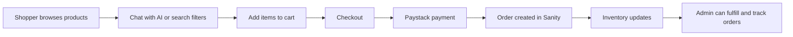
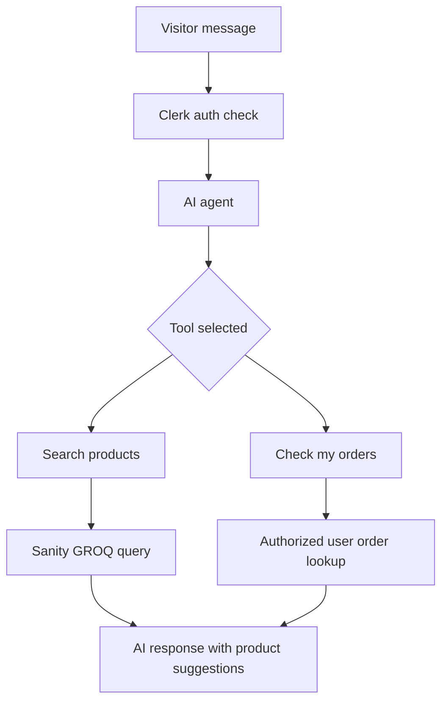

<!-- Badges -->
<div align="center">

[](https://nextjs.org/)
[](https://react.dev/)
[](https://www.typescriptlang.org/)
[](https://www.sanity.io/)
[](https://clerk.com/)
[](https://cohere.com/)
[](https://paystack.com/)
[](https://tailwindcss.com/)

**[Live Demo](https://beauty-henna-alpha.vercel.app/)** · **[Report Bug](https://github.com/Peculiars/beauty/issues)** · **[Request Feature](https://github.com/Peculiars/beauty/issues)**

</div>

---

# ✨ Beauty Couture

> A modern AI-powered beauty and lifestyle commerce platform built with Next.js, Sanity, Clerk, and Cohere — designed to blend elegant shopping experiences with smart business operations.

Beauty Couture is a full-stack e-commerce storefront and admin system for a beauty brand. It brings together secure shopping, live inventory, AI-assisted product discovery, and an admin dashboard for managing products, orders, and insights in one place.

---

## Why this project stands out

This project is more than a storefront. It combines the essentials of a production-ready commerce app with modern AI and CMS workflows:

- AI-powered product discovery for shoppers
- Authenticated user experience with Clerk
- Real-time content management with Sanity
- Inventory-aware order flows and admin operations
- Clean, responsive storefront design built with Next.js and Tailwind
- A reusable architecture that demonstrates full-stack patterns

---

## Core features

### Customer experience

- 🤖 AI shopping assistant for natural-language product search
- 🛒 Persistent cart with real-time stock awareness
- 🔐 Secure sign-in and account flows via Clerk
- 📦 Order history and status tracking for signed-in users
- 💳 Checkout with Paystack-powered payments
- 📱 Responsive storefront with premium UI styling
- 🧠 Product recommendations and smarter discovery logic

### Admin and business operations

- 📊 Inventory and sales insights dashboard
- 📝 Product, category, and order management
- ⚠️ Low-stock and operational alerts
- 📦 Order lifecycle updates from pending to fulfilled
- 🧑‍💼 Embedded Sanity Studio for content and data management
- 📈 Data-driven decisions with AI-enhanced reporting

### Technical highlights

| Area | Stack | Purpose |
|---|---|---|
| Frontend | Next.js 16 + React 19 | App router, server components, routes, UI |
| Styling | Tailwind CSS 4 | Utility-first UI system |
| CMS | Sanity | Product content, order data, schema-driven content model |
| Auth | Clerk | User sign-in, session handling, protected routes |
| AI | Cohere via AI SDK | Product discovery and conversational commerce |
| Payments | Paystack | Secure checkout and transaction handling |
| State | Zustand | Shopping cart and UI state persistence |
| Types | TypeScript + Sanity TypeGen | Safer, more maintainable app logic |

---

## Product workflow





---

## Getting started

### Prerequisites

- Node.js 18+
- pnpm
- A Sanity project
- A Clerk app
- A Paystack account
- A Cohere or AI Gateway API key

### 1. Clone the repository

```bash
git clone https://github.com/Peculiars/beauty.git
cd beauty
```

### 2. Install dependencies

```bash
pnpm install
```

### 3. Configure environment variables

Copy the example file and fill in your values:

```bash
cp .env.example .env.local
```

Example:

```bash
# Sanity
NEXT_PUBLIC_SANITY_PROJECT_ID=your_project_id
NEXT_PUBLIC_SANITY_DATASET=production
NEXT_PUBLIC_SANITY_ORG_ID=your_org_id
SANITY_API_WRITE_TOKEN=your_write_token

# Clerk
NEXT_PUBLIC_CLERK_PUBLISHABLE_KEY=your_publishable_key
CLERK_SECRET_KEY=your_secret_key

# Paystack
PAYSTACK_SECRET_KEY=your_secret_key
NEXT_PUBLIC_PAYSTACK_PUBLIC_KEY=your_public_key

# AI
AI_GATEWAY_API_KEY=your_ai_key
```

> Keep secrets in `.env.local` and never commit them to source control.

### 4. Generate types and import sample data

```bash
pnpm typegen
npx sanity dataset import sample-data.ndjson
```

### 5. Start the application

```bash
pnpm dev
```

Open http://localhost:3000 to view the app.

---

## Project structure

```text
beauty/
├── app/
│   ├── (app)/                # Storefront routes
│   ├── administrator/        # Admin dashboard routes
│   ├── api/                  # Backend API endpoints
│   ├── sign-in/              # Clerk sign-in routes
│   ├── studio/               # Embedded Sanity Studio
│   └── layout.tsx            # App shell and metadata
├── components/
│   ├── app/                  # Store UI components
│   ├── admin/                # Admin-side components
│   └── ui/                   # Shared UI primitives
├── lib/
│   ├── actions/              # Server actions
│   ├── ai/                   # AI agents and tools
│   ├── constants/            # Shared constants
│   ├── hooks/                # Reusable hooks
│   ├── sanity/               # Sanity queries/helpers
│   └── store/                # Zustand stores
├── sanity/
│   ├── schemaTypes/          # CMS schema definitions
│   ├── lib/                  # Sanity client utilities
│   ├── env.ts                # Sanity environment configuration
│   └── structure.ts          # Studio structure config
├── public/                   # Static assets
├── .env.example              # Environment variable template
├── package.json              # Scripts and dependencies
├── README.md                 # Project overview
├── sample-data.ndjson        # Seed data
├── sanity.types.ts           # Generated Sanity types
├── LICENSE.md                # License information
└── next.config.ts            # Next.js configuration
```

---

## Scripts

```bash
pnpm dev        # Start local development server
pnpm build      # Create production build
pnpm start      # Run production build
pnpm lint       # Run Biome checks
pnpm format     # Format code
pnpm typecheck  # Run TypeScript validation
pnpm typegen    # Generate Sanity TypeScript types
```

---

## Key architecture decisions

### Sanity as source of truth

Product, category, and order data live in Sanity so the content model stays flexible while the app can render live updates without complex custom storage logic.

### Clerk for authenticated experiences

Authentication and session context are managed with Clerk. This enables protected order access, better user-specific experiences, and secure AI flows.

### AI-powered product discovery

The application uses AI tools to interpret shopper requests and query product data in a meaningful, user-friendly way. This makes search feel more natural and conversion-friendly.

### Admin-first workflows

The platform is intentionally designed around business operations: inventory visibility, order updates, and analytics are first-class experiences rather than afterthoughts.

---

## Deployment

### Vercel deployment

The app is well-suited for Vercel deployment.

```bash
pnpm install -g vercel
vercel
```

After deployment, add your environment variables in the Vercel project settings and configure the relevant payment and CMS webhook URLs.

---

## Contributing

Contributions are welcome.

1. Fork the repository
2. Create a feature branch
3. Make your changes
4. Run formatting and validation
5. Open a pull request with a clear description

```bash
pnpm lint
pnpm typecheck
```

---

## License

This project is licensed under the MIT License. See [LICENSE.md](LICENSE.md) for details.

---

## Acknowledgements

Built with:

- [Next.js](https://nextjs.org/)
- [React](https://react.dev/)
- [TypeScript](https://www.typescriptlang.org/)
- [Sanity](https://www.sanity.io/)
- [Clerk](https://clerk.com/)
- [Cohere](https://cohere.com/)
- [Tailwind CSS](https://tailwindcss.com/)
- [Paystack](https://paystack.com/)

---

<div align="center">

### ⭐ If this project helps you, consider giving it a star.

**[Star this repo](https://github.com/Peculiars/beauty)**

</div>
